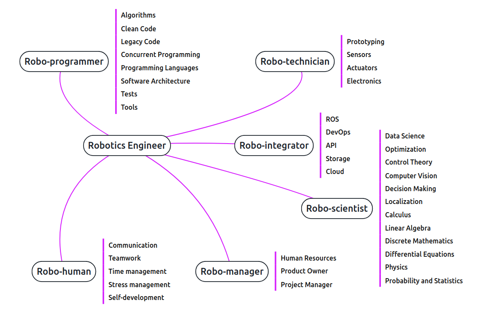

### Check out the [webpage](https://sarrasor.github.io/RoboticsRoadmap/)

[](https://sarrasor.github.io/RoboticsRoadmap/)


## How to run locally

### Requirements

- [Node.js 10+](https://nodejs.org/en/)
- [Yarn Classic](https://classic.yarnpkg.com/en/)

### Commands

Open terminal and type these commands:

```
git clone https://github.com/Sarrasor/RoboticsRoadmap.git
cd ./RoboticsRoadmap
yarn dev
```

Now you can go to `http://localhost:8080/` to see the website. All changes you make to the code will appear on the website dynamically

## How to contribute

### Suggestions

You are free to open an issue [here](https://github.com/Sarrasor/RoboticsRoadmap/issues/new)

### Modifications

1. Run the environment locally
2. Make your awesome changes
3. Run checks with `./check.sh` and visually examine your changes on `http://localhost:8080/`
4. Submit a Pull Request
5. Wait for the review

#### TODO

- [ ] Automatic tests
	- [x] Spell checker
	- [x] Link checker
	- [ ] Pre-commit checks
	- [ ] GitHub actions
		- [ ] Weekly link check
- [ ] Automatic mindmap generation
- [ ] Automatic table of contents generation
- [ ] Automatic GitHub Pages deploy on push to main
- [ ] Branch explanations
- [ ] Section explanations
- [ ] Usage guides
